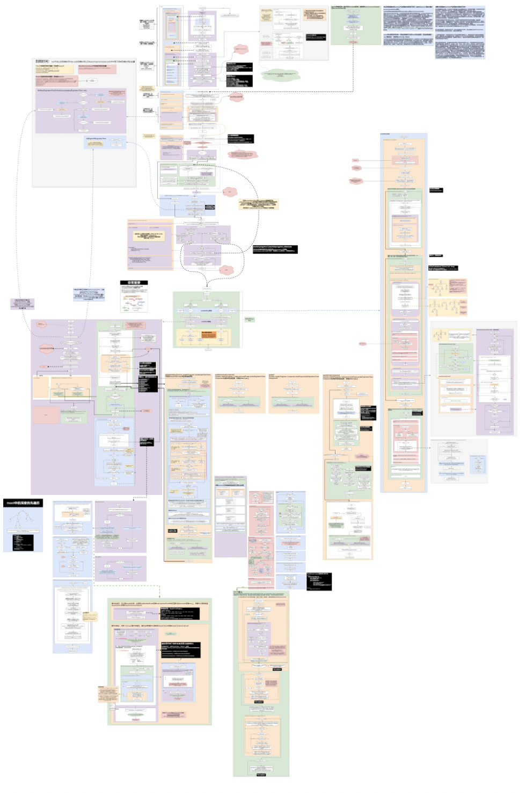

# 在线阅读
[猛戳这里👉react-note👈](https://buptlhuanyu.github.io/ReactNote/docs/react/react/intro)

包涵如下代码解析：
- react（全网首张唯一react源码流程高清大图）
- react-router
- react-hook-form
- react-transition-group
- 实用开发笔记

### 缩略图如下：


# 开发
```
yarn
yarn start
yarn build
```

# 远程部署

```
$ GIT_USER=<Your GitHub username> USE_SSH=true yarn deploy
```

If you are using GitHub pages for hosting, this command is a convenient way to build the website and push to the `gh-pages` branch.
