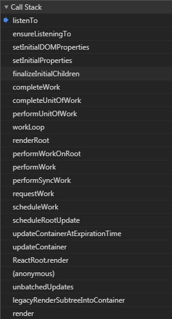
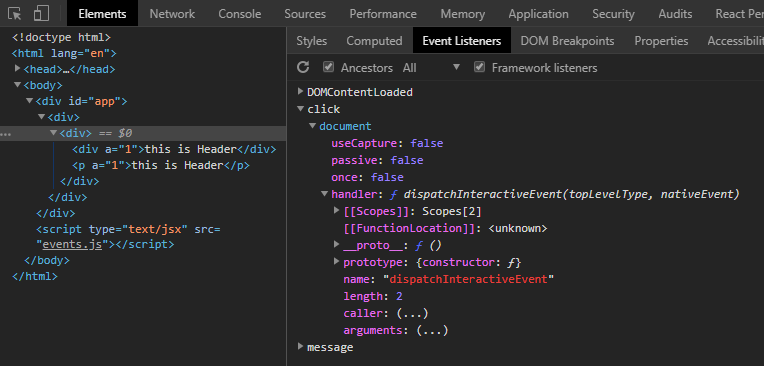
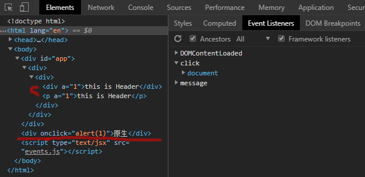
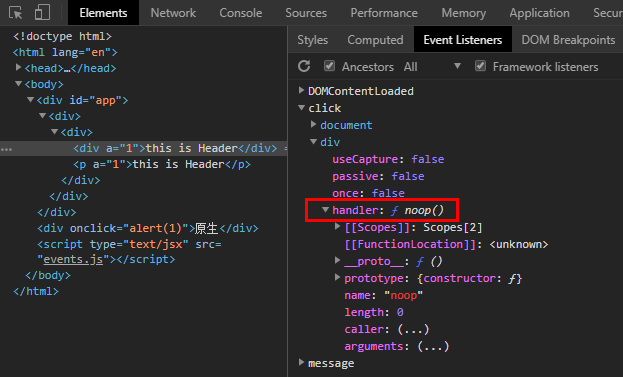
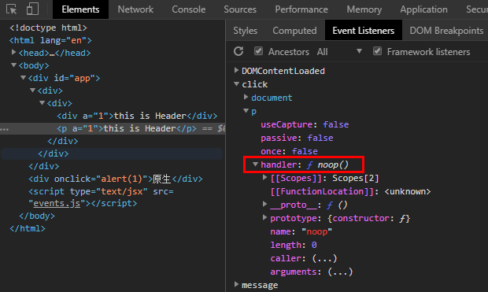
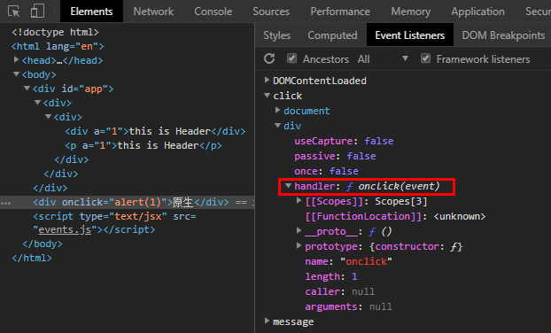
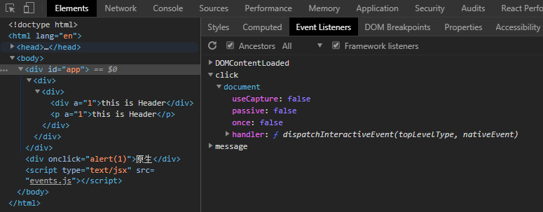
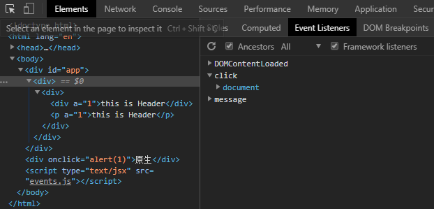
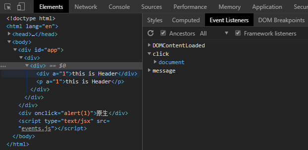

## 概述，背景
```
<div id="app"></div>
<div onclick="alert(1)">原生</div>

class APP extends React.Component{
    render(){
        return (
            <div>
                <Header/>
            </div>
        )
    }
}

class Header extends React.Component{
    clickHandler(){
        console.log("click")
    }
    render(){
        return (
            <div>
                <div onClick={this.clickHandler.bind(this)} a={1}>
                    this is Header
                </div>
                <p onClick={this.clickHandler.bind(this)} a={1}>
                    this is Header
                </p>
            </div>
        )
    }
}
ReactDOM.render(
    <APP/>,
    document.getElementById('app')
);
```
上述的组件中点击事件的绑定过程如下：



绑定阶段主要是在document上注册一些事件，如下：



可以看到，在渲染出来的DOM节点上并没有click事件，用到事件代理，当点击事件触发的时候，document监听到点击事件触发了，就会调用handler对应的函数dispatchInteractiveEvent开始分发点击事件，进而调用对应节点上的点击事件处理函数。

## 事件绑定后jsx与原生DOM的区别
为了做对比，写了一个原生的div以及对应的onclick事件处理函数，查看渲染出来的html可以知道：react的jsx写的onClick并没有在渲染出来的DOM上添加onclick事件处理函数，这与原生DOM不一样。



进一步查看react节点与原生DOM上的handler如下：







**可以看到**：react会将jsx上所有节点的onClick事件绑定到document上，然后为渲染出来的DOM添加一个空函数noop作为点击事件的处理函数。在document监听到点击事件的时候，会去fiber树上搜集之前jsx上添加的真正的处理函数，并存入数组，依次执行。

## 其他节点






