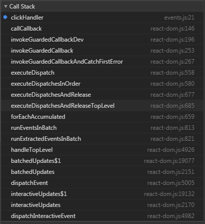
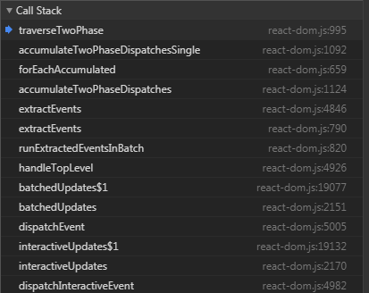
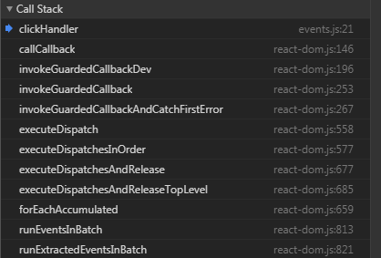

## 概述，背景
 ```
 <div id="app"></div>
<div onclick="alert(1)">原生</div>

class APP extends React.Component{
    render(){
        return (
            <div>
                <Header/>
            </div>
        )
    }
}

class Header extends React.Component{
    clickHandler(){
        console.log("click")
    }
    render(){
        return (
            <div>
                <div onClick={this.clickHandler.bind(this)} a={1}>
                    this is Header
                </div>
                <p onClick={this.clickHandler.bind(this)} a={1}>
                    this is Header
                </p>
            </div>
        )
    }
}
ReactDOM.render(
    <APP/>,
    document.getElementById('app')
);
 ```
 上述的组件中点击事件的触发过程如下：
 

`document`监听到某个`DOM`上冒泡上来的点击事件之后，调用`document`上的处理函数`dispatchInteractiveEvent`：
```
function dispatchInteractiveEvent(topLevelType, nativeEvent) {
  interactiveUpdates(dispatchEvent, topLevelType, nativeEvent);
}
```
react 内部会根据不同的环境来实现 `interactiveUpdates`函数，在浏览器环境下，ReactDOM.js 中该函数如下，其中 `fn(a, b)` 为 `dispatchEvent(topLevelType, nativeEvent)`
 ```
function interactiveUpdates<A, B, R>(fn: (A, B) => R, a: A, b: B): R {
  // 当多个触发事件，事件处理函数会执行多次，但是不能允许多次调用 performWork 或者 performSyncWork
  if (isBatchingInteractiveUpdates) {
    return fn(a, b);
  }
  // 
  if (
    !isBatchingUpdates && // 批量更新，比如事件触发多次的批处理
    !isRendering && // 不处于performWorkOnRoot函数执行过程中，renderRoot与提交阶段结束之后performWorkOnRoot结束执行
    lowestPriorityPendingInteractiveExpirationTime !== NoWork // 有挂起的交互事件
  ) {
    performWork(lowestPriorityPendingInteractiveExpirationTime, false);
    lowestPriorityPendingInteractiveExpirationTime = NoWork;
  }
  const previousIsBatchingInteractiveUpdates = isBatchingInteractiveUpdates;
  const previousIsBatchingUpdates = isBatchingUpdates;
  isBatchingInteractiveUpdates = true;
  isBatchingUpdates = true;
  try {
    return fn(a, b);
  } finally {
    isBatchingInteractiveUpdates = previousIsBatchingInteractiveUpdates;
    isBatchingUpdates = previousIsBatchingUpdates;
    if (!isBatchingUpdates && !isRendering) {
      performSyncWork();
    }
  }
}
 ```
`dispatchEvent`会调用`batchedUpdates`，其中会调用`handleTopLevel`，`handleTopLevel`会调用`runExtractedEventsInBatch`
```
function runExtractedEventsInBatch(topLevelType, targetInst, nativeEvent, nativeEventTarget) {
    // 合成事件的生成以及在fiber树上通过模拟捕获与冒泡收集事件处理函数与对应节点并存储到合成事件的相关属性上
    var events = extractEvents(topLevelType, targetInst, nativeEvent, nativeEventTarget);
    // 开始执行合成事件上的相关属性存储的执行事件处理函数
    runEventsInBatch(events);
}
```
`runExtractedEventsInBatch`函数中会先将事件名称`topLevelType`、对应的`react`元素实例`targetInst`、原生事件对象`nativeEvent`以及事件作用的`DOM`传入`extractEvents`中，`extractEvents`函数会遍历事件插件数组`plugins`，并通过传入的事件名称`topLevelType`选择对应的`plugin`，并调用该`plugin`上的`extractEvents`，生成合成事件`SyntheticEvent`，并收集事件触发的目标节点以及以上的祖先节点需要触发的事件处理函数和对于的`fiber`分别存入合成事件的`_dispatchListeners`与`_dispatchInstances`属性上，捕获阶段的函数与节点在数组靠前位置，祖先节点‘越老’其事件处理函数以及该节点在数组中的位置越靠前；冒泡阶段的函数与节点在数组靠后位置，祖先节点‘越老’其事件处理函数以及该节点在数组中的位置越靠后；

## 合成事件对象
```
runExtractedEventsInBatch函数中合成事件对象的逻辑：
var events = ex：tractEvents(topLevelType, targetInst, nativeEvent, nativeEventTarget);
```
#### 首先看合成事件对象的生成
对于点击事件调用的是`simpleeventplugin`上的`extractEvents`函数，该函数会传入的参数是`dispatchConfig, targetInst, nativeEvent, nativeEventTarget`，其中`dispatchConfig`是由`topLevelType`从`topLevelEventsToDispatchConfig`数组中获取的配置，在`simpleeventplugin.extractEvents`函数中会调用如下代码根据事件配置`dispatchConfig`将事件对应的`react`元素实例、原生事件、原生事件对应的`DOM`封装成为一个合成事件。
```
var event = EventConstructor.getPooled(dispatchConfig, targetInst, nativeEvent, nativeEventTarget)
```
`EventConstructor.getPooled`实际就是`react\packages\events\SyntheticEvent.js`下的`getPooledEvent`函数，从其代码中可以看到会从事件池中去取一个合成事件对象，然后利用这个对象用新的  `dispatchConfig,targetInst,nativeEvent,nativeInst`重新初始化即可；如果事件池为空，则新创建一个合成事件对象。
```
function getPooledEvent(dispatchConfig, targetInst, nativeEvent, nativeInst) {
  const EventConstructor = this;
  if (EventConstructor.eventPool.length) {
    const instance = EventConstructor.eventPool.pop();
    EventConstructor.call(
      instance,
      dispatchConfig,
      targetInst,
      nativeEvent,
      nativeInst,
    );
    return instance;
  }
  return new EventConstructor(
    dispatchConfig,
    targetInst,
    nativeEvent,
    nativeInst,
  );
}
```

###### 从数据结构看合成事件与原生事件的关系
```
function SyntheticEvent(
  dispatchConfig,
  targetInst,
  nativeEvent,
  nativeEventTarget,
) {
  this.dispatchConfig = dispatchConfig;
  this._targetInst = targetInst;
  this.nativeEvent = nativeEvent;

  const Interface = this.constructor.Interface;
  for (const propName in Interface) {
    if (!Interface.hasOwnProperty(propName)) {
      continue;
    }
    const normalize = Interface[propName];
    if (normalize) {
      this[propName] = normalize(nativeEvent);
    } else {
      if (propName === 'target') {
        this.target = nativeEventTarget;
      } else {
        this[propName] = nativeEvent[propName];
      }
    }
  }

  const defaultPrevented =
    nativeEvent.defaultPrevented != null
      ? nativeEvent.defaultPrevented
      : nativeEvent.returnValue === false;
  if (defaultPrevented) {
    this.isDefaultPrevented = functionThatReturnsTrue;
  } else {
    this.isDefaultPrevented = functionThatReturnsFalse;
  }
  this.isPropagationStopped = functionThatReturnsFalse;
  return this;
}
```
可以看到原生事件存储在合成事件对象的`nativeEvent`属性上，目标`react`元素实例存储在`_targetInst`属性上，`dispatchConfig`存储在`dispatchConfig`属性上，将原生事件对应的`DOM`即`nativeEventTarget`存储在合成事件的target属性上。原生事件对象上`type`、`eventPhase`、`bubbles`、`cancelable`、`defaultPrevented`、`isTrusted`存储在合成事件相同名称的属性上。

###### 为什么事件池会提高性能
从`getPooledEvent`函数与合成事件对象的数据结构可知，`React`合成的`SyntheticEvent`采用了池的思想，从而达到节约内存，避免频繁的创建和销毁事件对象的目的。

####  然后收集事件处理函数与对应节点并存储到合成事件对象上
这个是在特定的事件插件的`extractEvents`函数中调用`EventConstructor.getPooled`获取合成事件之后进行处理函数的收集。即如下调用`accumulateTwoPhaseDispatches(event)`
```
var event = EventConstructor.getPooled(dispatchConfig, targetInst, nativeEvent, nativeEventTarget);
accumulateTwoPhaseDispatches(event);
```
`accumulateTwoPhaseDispatches`中收集事件处理函数的调用栈为：


traverseTwoPhase的代码在[之前的文章](https://github.com/BUPTlhuanyu/ReactNote/blob/master/react/blog/D2/react%E6%BA%90%E7%A0%81%E6%B5%85%E6%9E%90\(%E4%BA%8C\)%EF%BC%9Ashared%E6%96%87%E4%BB%B6%E5%A4%B9%E4%B9%8BReactTreeTraversal.md)中有分析，
```
export function traverseTwoPhase(inst, fn, arg) {
  const path = [];
  //将inst的父节点入栈，数组最后的为最远的祖先
  while (inst) {
    path.push(inst);
    inst = getParent(inst);
  }
  let i;
  //从最远的祖先开始向inst节点捕获执行fn
  for (i = path.length; i-- > 0; ) {
    fn(path[i], 'captured', arg);
  }
    //从inst节点开始向最远的祖先节点冒泡执行fn
  for (i = 0; i < path.length; i++) {
    fn(path[i], 'bubbled', arg);
  }
}
```
在虚拟DOM树中其实就是`fiber`树，将当前事件触发的目标节点开始向上遍历的祖先节点挨个存入`path`中，然后从祖先节点开始向目标节点进行遍历对应的就是从数组的从尾向头开始遍历（这里模拟的是捕获，所以从祖先节点开始向下遍历），这个遍历过程中，将遍历到的当前节点、合成事件对象、代表捕获还是冒泡阶段的标志作为参数传入`accumulateDirectionalDispatches`，在其中执行`listenerAtPhase`获取该绑定在该节点上需要在捕获阶段触发的事件处理函数，然后将获取到的事件处理函数`listener`与事件上的存储处理函数数组`event._dispatchListeners`传入`accumulateInto`，并将当前处理函数`push`到`event._dispatchListeners`中；同样调用`accumulateInto`将捕获阶段中当前绑定了需要捕获阶段触发的事件的节点存储到`event._dispatchInstances`，至此`accumulateDirectionalDispatches`执行完毕，也就是收集到了所有需要捕获阶段执行的事件处理函数与相对应的节点分别存储在合成事件对象上的`_dispatchListeners`与`_dispatchInstances`上。捕获阶段，父节点以及其处理函数位于数组的开头部分，模拟捕获的事件触发顺序。

按照上述逻辑，冒泡阶段，对应与在`traverseTwoPhase`中的第二个`for`循环，会依次调用`accumulateDirectionalDispatches`对事件触发的目标节点以及以上的父节点进行事件处理函数与绑定了事件处理函数的节点的收集，并将这些函数与节点分别添加在合成事件的`_dispatchListeners`与`_dispatchInstances`上。
```
function accumulateDirectionalDispatches(inst, phase, event) {
    {
        !inst ? warningWithoutStack$1(false, 'Dispatching inst must not be null') : void 0;
    }
    var listener = listenerAtPhase(inst, event, phase);
    if (listener) {
        event._dispatchListeners = accumulateInto(event._dispatchListeners, listener);
        event._dispatchInstances = accumulateInto(event._dispatchInstances, inst);
    }
}
// 获取捕获阶段的事件名registrationName
function listenerAtPhase(inst, event, propagationPhase) {
    var registrationName = event.dispatchConfig.phasedRegistrationNames[propagationPhase];
    return getListener(inst, registrationName);
}    
// 开始根据registrationName在当前节点上的props中获取对应的事件处理函数
function getListener(inst, registrationName) {
    var listener = void 0;

    // TODO: shouldPreventMouseEvent is DOM-specific and definitely should not
    // live here; needs to be moved to a better place soon
    var stateNode = inst.stateNode;
    if (!stateNode) {
        // Work in progress (ex: onload events in incremental mode).
        return null;
    }
    var props = getFiberCurrentPropsFromNode(stateNode);
    if (!props) {
        // Work in progress.
        return null;
    }
    listener = props[registrationName];
    if (shouldPreventMouseEvent(registrationName, inst.type, props)) {
        return null;
    }
    !(!listener || typeof listener === 'function') ? invariant(false, 'Expected `%s` listener to be a function, instead got a value of `%s` type.', registrationName, typeof listener) : void 0;
    return listener;
}
```
至此对于下面的结构：
```
<div id='div1' onClick={this.clickHandler1.bind(this)} a={1}>
    <div id='div2' onClick={this.clickHandler2.bind(this)} a={1}>
        <div id='div3' onClick={this.clickHandler3.bind(this)} a={1}>
            this is Header
        </div>
    </div>
</div>
```
合成事件上的`_dispatchListeners`与`_dispatchInstances`上分别为：
```
_dispatchListener = [
    clickHandler1,
    clickHandler2,
    clickHandler3
]
_dispatchInstances = [
    id为'div1'的fiberNode,
    id为'div2'的fiberNode,
   id为'div3'的fiberNode
]
```

##  执行合成事件对象上的事件处理函数
```
runExtractedEventsInBatch 执行合成事件对象上的事件处理函数的逻辑：
runEventsInBatch(events);
```
触发过程的函数调用栈如下：


经过上述的逻辑之后，会从头到尾的调用合成事件对象上`_dispatchListeners`上的事件处理函数。到此本文重点在弄清楚了合成事件对象和原生事件对象的关系，以及如何收集`fiber`树上的事件处理函数。至于如何执行，是明天研究的内容了。当然还是接着这个写吧。
从`runEventsInBatch`开始，最后调用合成事件上的事件处理函数：
```
//将新的合成事件对象添加到原来的对象队列中，然后进入下一个处理环节forEachAccumulated
export function runEventsInBatch(events) {
  if (events !== null) {
    // 将当前生成的合成事件对象或者合成事件对象数组添加到之前的合成事件对象队列中，构成新的队列
    eventQueue = accumulateInto(eventQueue, events);
  }
  //  将新的合成事件对象队列eventQueue作为正在处理的队列processingEventQueue，并将前者清空
  const processingEventQueue = eventQueue;
  eventQueue = null;
  if (!processingEventQueue) {return;}
  //进入下一步
  forEachAccumulated(processingEventQueue, executeDispatchesAndReleaseTopLevel);
}
```
`runEventsInBatch`将**新的合成事件对象合并到原来的对象队列**中，然后进入下一个处理环节`forEachAccumulated`，可见`react`的每个函数的缜密，每一步都添加了对应的错误处理机制。`forEachAccumulated`函数源码：
```
function forEachAccumulated(arr,cb,scope,) {
  if (Array.isArray(arr)) {
    arr.forEach(cb, scope);
  } else if (arr) {
    cb.call(scope, arr);
  }
}
```
`forEachAccumulated`会对传入的`arr`数组的元素挨个执行`cb(arr[i])`，这里的`cb`为上一步中传入的`executeDispatchesAndReleaseTopLevel`，`arr``为processingEventQueue`。`arr`如果不是数组直接执行`cb(arr)` ，因此主要看executeDispatchesAndReleaseTopLevel的逻辑：
```
const executeDispatchesAndReleaseTopLevel = function(e) {
  return executeDispatchesAndRelease(e);
};
const executeDispatchesAndRelease = function(event: ReactSyntheticEvent) {
  if (event) {
    executeDispatchesInOrder(event);

    if (!event.isPersistent()) {
      event.constructor.release(event);
    }
  }
};

```
先看第二步：这里先看`if`中的`if`，如果合成事件对象的状态不是 `isPersistent` 即 `event.isPersistent`返回的始终是`false`，那么这里始终会执行`release`重置`event`上的属性值，并添加到事件对象池的空余位置，重置合成事件对象的代码如下：
```
react\packages\events\SyntheticEvent.js
//重置event上的属性值，并添加到事件对象池的空余位置
function releasePooledEvent(event) {
  const EventConstructor = this;
  //
  event.destructor();
  if (EventConstructor.eventPool.length < EVENT_POOL_SIZE) {
    EventConstructor.eventPool.push(event);
  }
}
//合成事件对象实例重置
destructor: function() {
    const Interface = this.constructor.Interface;
    for (const propName in Interface) {
        this[propName] = null;
    }
    this.dispatchConfig = null;
    this._targetInst = null;
    this.nativeEvent = null;
    this.isDefaultPrevented = functionThatReturnsFalse;
    this.isPropagationStopped = functionThatReturnsFalse;
    this._dispatchListeners = null;
    this._dispatchInstances = null;
});
```
> 这里涉及一个实际开发中的一个关键问题，为什么涉及到异步函数中需要用到 `event.persist()` ？

在上一个 `if` 块中会执行 `executeDispatchesInOrder(event)` 来依次执行事件处理函数，并且共用一个 `event`（因此只要有一个事件处理函数调用了`persist`，那么其他的函数的异步代码都能访问到有效的合成事件对象），等所有事件处理函数的同步代码执行完成之后，如果所有处理函数都没调用合成事件对象的`persist`函数， 那么就会重置这个合成事件对象上的属性值，并将空的合成事件对象添加到事件池中（如果池子满了，无需添加最终会被自动 `GC`）。这里调用 `event.persist` 会改变 `event` 的状态为 `isPersistent`，能够避免所有事件处理函数执行完之后合成事件对象被重置。

接着看关键的第一步，`executeDispatchesInOrder`是如何执行合成事件对象上的事件处理函数的：
```
export function executeDispatchesInOrder(event) {
  const dispatchListeners = event._dispatchListeners;
  const dispatchInstances = event._dispatchInstances;
  if (Array.isArray(dispatchListeners)) {
    for (let i = 0; i < dispatchListeners.length; i++) {
      if (event.isPropagationStopped()) {
        break;
      }
      // Listeners and Instances are two parallel arrays that are always in sync.
      executeDispatch(event, dispatchListeners[i], dispatchInstances[i]);
    }
  } else if (dispatchListeners) {
    executeDispatch(event, dispatchListeners, dispatchInstances);
  }
  event._dispatchListeners = null;
  event._dispatchInstances = null;
}
```
从上面代码的循环可以看到，遍历`event._dispatchListeners`上的监听器，首先通过合成事件对象上的`isPropagationStopped()`来判断是否阻止捕获和冒泡阶段中当前事件的进一步传播，如果有则往后的事件处理函数都无法被执行。如果没有阻止传播，那么会调用 `executeDispatch`执行事件处理函数，最终将合成事件对象上的`_dispatchListeners`与`_dispatchInstances`清空。现在来看`executeDispatch`：
```
function executeDispatch(event, listener, inst) {
  const type = event.type || 'unknown-event';
  //获取当前fiber对应的真实DOM
  event.currentTarget = getNodeFromInstance(inst);
  //进入下一步
  invokeGuardedCallbackAndCatchFirstError(type, listener, undefined, event);
  event.currentTarget = null;
}
```
`executeDispatch`会将当前传入的这个`fiber`的真实DOM存储在合成事件对象上的`currentTarget`属性上，然后将合成事件对象与当前fiber对应的事件处理函数一起传入`invokeGuardedCallbackAndCatchFirstError`：
```
react\packages\shared\ReactErrorUtils.js

function invokeGuardedCallbackAndCatchFirstError(name,func,context,a,b,c,d,e,f) {
  invokeGuardedCallback.apply(this, arguments);
}
export function invokeGuardedCallback(name,func,context,a,b,c,d,e,f) {
  invokeGuardedCallbackImpl.apply(reporter, arguments);
}
//在开发环境下invokeGuardedCallbackImpl = invokeGuardedCallbackDev;
//invokeGuardedCallbackDev中涉及到如何处理错误，保证了系统的健壮性——TODO
//react\packages\shared\invokeGuardedCallbackImpl.js
let invokeGuardedCallbackImpl = function(name,func,context,a,b,c,d,e,f){
  const funcArgs = Array.prototype.slice.call(arguments, 3);
  try {
    func.apply(context, funcArgs);
  } catch (error) {
    this.onError(error);
  }
};
```
 最终通过`invokeGuardedCallbackImpl`中调用`func.apply(context, funcArgs)`，执行事件处理函数。
 
 ## 总结
1. 合成事件对象的初始化
2. 在`fiber`树上模拟捕获与冒泡事件，即先模拟捕获阶段，从远古祖先节点`document`开始向事件触发的目标节点遍历，遍历的过程搜集需要在捕获阶段触发的事件处理函数以及对应的节点并存入合成事件对象的相关属性；然后模拟冒泡阶段，从事件触发的目标节点开始向远古祖先节点`document`开始遍历，遍历的过程搜集需要在冒泡阶段触发的事件处理函数以及对应的节点并存入之前存储了捕获阶段的函数与节点的相关属性的数组中；在两个遍历之初会遍历一遍事件目标节点以上的树并以此存入一个数组中，然后捕获和冒泡都是遍历这个数组。
3. 将新的合成事件对象添加到已有的事件对象队列中，然后开始依次执行队列中每个合成事件对象上存储的事件处理函数数组。
 
 ## 彩蛋bind
#### 改装事件监听器函数：
通过`addEventListener`添加的事件处理函数只有一个输入参数为`event`事件。
如下:

```
element.addEventListener(eventType, listener, true);
```

现在的需求是：
当事件触发的时候，想调用下面这个函数

```
function dispatchInteractiveEvent(type, event) {
    ...
}
```

> 最容易想到的方法是：
```
const listener = function(event){
    // 一些和type变量有关的逻辑
        ...
    dispatchInteractiveEvent(type, event)
}
element.addEventListener(eventType, listener, true);
```

> 利用bind实现：
```
// 一些和type变量有关的逻辑
    ...
const listener = dispatchInteractiveEvent.bind(null, type);
element.addEventListener(eventType, listener, true);
```

> 这两者的区别：

`bind`实现可以将`type`的逻辑放到外层作用域，并且在事件触发之前`type`就计算好了。而第一种方法事件触发调用回调的时候才计算`type`，这个时候必然造成内存泄漏，因为`type`的逻辑可能涉及到外层作用域的局部变量。`bind`实现，`type`已经计算好了，所以垃圾回收机制会自动回收不用的变量。

总的一句话就是：第一种造成了闭包的效果。

 ## 彩蛋apply巧妙拼接两个数组
 #### 利用`apply`将数组b添加到数组a后面
```
var a=[1,2]，b=[3,4]
a.push.apply(a,b) // 返回数组a的长度
a // [1, 2, 3, 4]
b // [3, 4]
```
`apply`在这里主要的作用是可以将数组作为参数传入，然后一个一个对数组中的元素执行`a.push(b[i])`,这里this必须指向`a`。

#### 与concat的不同

```
var a=[1,2]，b=[3,4]
a.concat(b) // 返回新的数组，由a与b数组组成
```

#### 总结
这里`apply`可以节省内存，不需要创建新的数组。

#### 来源react源码的accumulateInto函数
该函数保持传入的第二个参数不发生改变
```
function accumulateInto(
  current,
  next,
) {
  if (current == null) {
    return next;
  }
  if (Array.isArray(current)) {
    if (Array.isArray(next)) {
      current.push.apply(current, next);
      return current;
    }
    current.push(next);
    return current;
  }

  if (Array.isArray(next)) {
    return [current].concat(next);
  }

  return [current, next];
}
```
