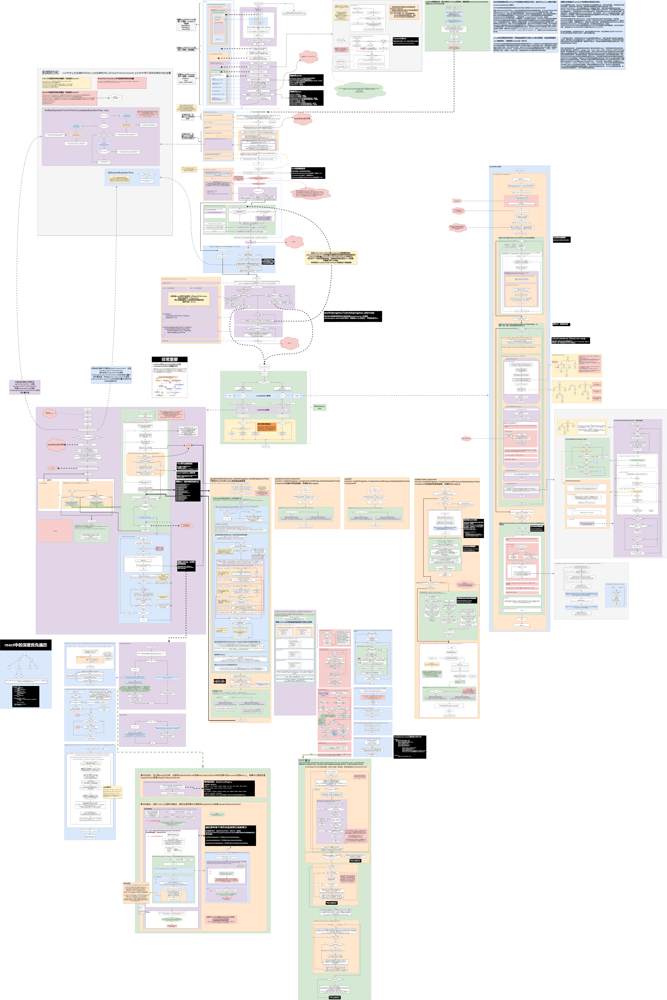

# 🔥🔥🔥对react相关代码库以及框架的源码进行了一定的分析
高清大图，获取地址：
- 链接:https://pan.baidu.com/s/1EfTWzqC4psW8kq5kYP-v9A
- 密码:8nqr 

# 心得

读源码大致总结了一下几个阶段，也是为什么我需要总结这样的一个流程图，`流程图把握整体，文章深入细节`：
1. 通过文字的形式记录，逻辑理清楚了，能说明白就很不容易了；但是从文字上很难把握全局，后期回顾的时候比较慢，查 bug 原因会有不少阻力。
2. 通过流程图的形式记录，鸟瞰整体，能清楚各个模块功能，后期回顾的时候比较快，查 bug 原因相对轻松。

流程图中也总结了一些 react 中比较常用的概念以及一些很容易误解的地方，比如 
-  setState 何时何地是同步或者异步，原因是什么（是否空闲，是否是concurrent模式，处于react什么阶段决定了其到期时间，也就决定了是异步还是同步）？
-  常说绑定事件函数在构造函数里 bind，props的属性不要传字面量对象，这些措施一定就有效？什么场景有效（结合 shouldComponentDidUpdate，pureComponent，还有一些入参是 nextProps的手动比较的地方，这些都应该考虑在内）？

PS： 推荐一下 react status，这个周刊会一直推送给你最新的react进展与相关的代码库。

非常希望大家能和我一起讨论，不管是react源码还是react status中有趣的文章，欢迎在issue中留言。如果感兴趣，可以点个star关注一下这个仓库的更新。

更多文章敬请关注公众号:

