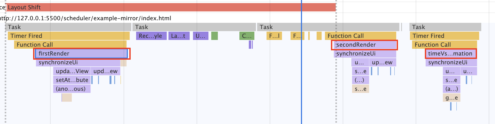

# 存在即合理

​		为了弥补`requestIdleCallback`的兼容问题而产生了`scheduler`，而实现`scheduler`为何需要宏任务而不是微任务？宏任务为何选择`message channel`而不用`setTimeout`？接下来将通过实际的例子为你解析。部分例子来源于[`electron-progress`](https://www.npmjs.com/package/electron-progress)。

### 浏览器渲染帧与显示屏的刷新频率 ###

首先我们需要介绍一下事件循环，重绘，帧率三者之间的关系。

帧：通俗来说就是一张一张展示的画面，由于现在广泛使用的屏幕都有固定的刷新率（比如最新的一般在 60Hz）， 在两次硬件刷新之间浏览器绘制多张画面是没有意义的，只会消耗性能，因为下一次屏幕刷新的时候也只能看到最后绘制的一张图片。因此，在正常情况下浏览器渲染出一帧画面的间隔就是硬件的每一帧图像的时间间隔，即刷新频率的倒数。此外设备的`fps`也会影响这个时间间隔。

在浏览器呈现两幅图像的时间间隔(16.7ms)里，会多次执行事件循环[event loop](https://html.spec.whatwg.org/multipage/webappapis.html#event-loops)中的任务队列，各种任务的执行是有先后顺序的，详细可以参看[processing model](https://html.spec.whatwg.org/multipage/webappapis.html#event-loop-processing-model)，我们主要关注一下几点：

- 脚本执行（JavaScript）：脚本造成了需要重绘的改动，比如增删 DOM、请求动画等
- 样式计算（CSS Object Model）：级联地生成每个节点的生效样式。
- 布局（Layout）：计算布局，执行渲染算法
- 重绘（Paint）：各层分别进行绘制（比如 3D 动画）
- 合成（Composite）：合成各层的渲染结果

经过合成之后的图像会被渲染出来，而一帧间隔之内可能由于js的操作导致了多次合成，也就渲染出了多幅图像，而屏幕刷新的时候只展示最后一张，因此我们丢失了一些图像从而导致页面有卡顿的感觉。

这里需要注意在这16.7ms中，包括了js脚本执行，需要js线程，而渲染需要的是gui渲染线程，而这两个线程是互斥的。当浏览器在执行JavaScript程序的时候，GUI渲染线程会被保存在一个队列中，直到JS程序执行完成，才会接着执行。因此如果JS执行的时间过长，这样就会造成页面的渲染不连贯，导致页面渲染加载阻塞的感觉。

### 比 setTimeout 更快的 postmessage

`react-scheduler`模块是基于`requestAnimation`以及`message Chanel`实现的，`requestAnimation`以及`message Chanel`都是宏任务，根据[processing model](https://html.spec.whatwg.org/multipage/webappapis.html#event-loop-processing-model)可以知道前者的触发时机是在重绘之前。那么为什么使用`message Chanel`而不使用`setTimeout`来做呢？我们对比一下这两者我们会发现`message Chanel`更快，测试代码见[setTimeout vs requestAnimation](https://github.com/BUPTlhuanyu/Deep-into-JS/tree/master/scheduler/example-mirror/timeoutVsRequestAnimation)。

```javascript
function firstRender() {
    // 第一次event loop，修改文字
    state.infoTextProps.text = '第一次';
    synchronizeUi();

    // 第三次event loop，修改文字
    function timeVsRequestAnimation() {
        state.infoTextProps.text = '第三次';
        synchronizeUi();
    };

    setTimeout(timeVsRequestAnimation, 0);

    // 第三次event loop，修改文字
    function secondRender() {
        state.infoTextProps.text = '第二次';
        synchronizeUi();
    }
    window.addEventListener('message', secondRender);
    window.postMessage('123', '*');
}
setTimeout(firstRender, 2000);
```

上面这段代码目的是在两秒之后调用`firstRender`修改页面中的文字内容，并在`0`秒之后再次修改文字内容，最后在`message channel`的回调中修改文字内容。

通过`performance`面板我们可以看到，第一次修改文字内容之后，浏览器在下一个`task`中合成一张图像等待渲染。紧接着`postmessage`触发的宏任务会在下一次事件循环中被执行。而setTimeout的回调则是在第三次事件循环中被执行。有下面两点结论：

1. `postmessage`的回调是在`setTimeout`回调之前执行，更近一步可以参看[对比实验](https://dbaron.org/mozilla/zero-timeout)，实验结论是触发`postmessage`到执行回调的时间间隔远小于setTimeout。
2. 图中还有`layout shift`，这是因为文字的外层容器没有设定宽度导致的。可以参看[layout shift](https://umaar.com/dev-tips/202-layout-shift-regions/)。



### 对requestAnimation的一些思考

根据`requestAnimation`在[MDN](https://developer.mozilla.org/zh-CN/docs/Web/API/Window/requestAnimationFrame)中的定义，我们可以归纳出下面两个特点：

> **`window.requestAnimationFrame()`** 
>
> 1. 该方法需要传入一个回调函数作为参数，该回调函数会在浏览器下一次重绘之前执行
> 2. 在同一个帧中的多个回调函数，它们每一个都会接受到一个相同的时间戳，即使在计算上一个回调函数已经消耗了一些时间。

`requestAnimation`在实现`js`动画的时候会经常用到，其回调函数都会在下一次重绘之前执行（只考虑符合HTML标准的浏览器），因此这个回调函数中如果有比较耗时的计算那么势必会阻塞浏览器的重绘，导致失帧而卡顿。可以看一个例子，代码在[测试requestAnimation](https://github.com/BUPTlhuanyu/Deep-into-JS/tree/master/scheduler/example-mirror/requestAnimation)：

```javascript
function synchronizeUi(){
    let i = 0;
    while (i < 10000) {
        console.log(i++);
    }
    updateProgressView();
    updateInfoView();
}
```

这个例子中的`requestAnimation`的回调函数中人为的添加了耗时的计算，导致进度条动画的卡顿。

因此我们在使用的时候需要将动画的计算逻辑与操作`dom`的逻辑分开，在`requestAnimation`的回调中操作dom，在浏览器`空闲时间`里执行动画的计算逻辑。这里的`空闲时间`我们可以利用`requestIdleCallback`来实现。其[MDN](https://developer.mozilla.org/zh-CN/docs/Web/API/Window/requestIdleCallback)定义如下：

>**`window.requestIdleCallback()`**方法将在浏览器的空闲时段内调用的函数排队。这使开发者能够在主事件循环上执行后台和低优先级工作，而不会影响延迟关键事件，如动画和输入响应。函数一般会按先进先调用的顺序执行，然而，如果回调函数指定了执行超时时间`timeout`，则有可能为了在超时前执行函数而打乱执行顺序。

可惜这个`api`还是一个实验中的功能，兼容性还不够好（或许各浏览器实现该方法之后，`react-scheduler`应该就成为历史了）；

### react-scheduler登场

`react-scheduler`的作用就是为了模拟实现`requestIdleCallback`来解决兼容性问题。有以下几个关键点：

1. 如何计算当前帧是否有空闲时间
2. 在什么时机计算当前帧是否有空闲时间。
3. 如何不阻塞当前事件循环中的重绘，并且能够及时响应用户的操作
4. 有空闲时间的时候如何尽快的执行任务

应该在`requestAnimation`的回调中计算是否有空闲时间，然后利用`postmessage`来执行空闲时间中需要执行的任务。

使用宏任务的原因是不会阻塞`requestAnimation`回调后的重绘，并且能够有时间空隙来执行用户操作导致的宏任务。而使用`postmessage`这个宏任务的原因则是从触发到回调执行的时间间隔最短[postmessage is faster](https://github.com/BUPTlhuanyu/Deep-into-JS/blob/master/scheduler/example-mirror/timeoutVsRequestAnimation/performance.html)。


# 总结

​	本片介绍了`react-scheduler`模拟实现`requestIdleCallback`的原因以及方法，并通过例子验证了`postmessage`为何比`setTimeout`更适合模拟实现`requestIdleCallback`。那么下一篇将会实现一个`scheduler`。


​	


​	