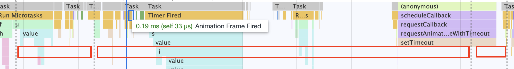
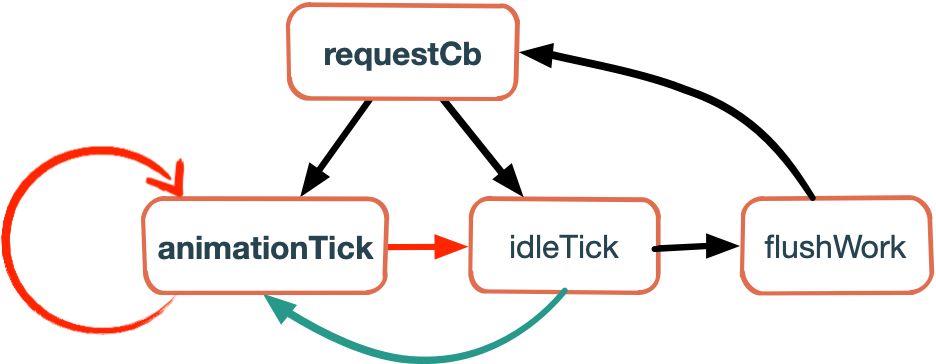

## 帧对齐方案scheduler

这一部分主要讨论的是如何实现帧对齐，而不会过多的去探究旧版方案的调度流程。如果想了解可以直接看源码，或者去到这里[scheduler](https://juejin.cn/post/6844903792110993421)

#### 必要的回顾

早在之前的文章中介绍了`requestAnimation`的几个重要的特性：

> **`window.requestAnimationFrame()`** 
>
> 1. 该方法需要传入一个回调函数作为参数，该回调函数会在浏览器下一次重绘之前执行
> 2. 在同一个帧中的多个回调函数，它们每一个都会接受到一个相同的时间戳，即使在计算上一个回调函数已经消耗了一些时间。
> 3. 在大多数遵循W3C建议的浏览器中，回调函数执行次数通常与浏览器屏幕刷新次数相匹配



上图为`chrome performance`面板中获取到的各个帧的截图，红框的长度表示一帧间隔，同一个红框当中执行的`requestAnimation`回调函数接收到的时间戳都是相同的值。一般而言，对于一个刷新频率为`60hz`的屏幕来说，回调函数会在`16.7ms`之后执行。那么`react-scheduler`则需要动态的识别浏览器的刷新频率。

#### 新老scheduler的对比



先简单介绍`frame`对齐方案的基本流程，如下图所示，我们在通过`scheduleCallback`添加任务的时候会调用`requestCallback`，这个函数会通过判断最高优先级的任务是否已经到期了，如果到期了会在下一个事件循环中通过`idleTick`调用`flushWork`去刷新链表中（新版的优先队列使用最小堆来实现时间复杂度从`n`提升到`logn`）中已到期的任务。并且如果还有任务存留则会调用`requestAnimation`，目的是在下一次重绘之前把剩余的任务检查一下，看有没有任务需要通过`idleTick`执行。

此外需要注意一点，在`flushWork`不断执行过期任务的过程中，是不是可以将所有到期的任务都执行完成呢？并非如此，在任务执行时间比较短的前提下（代码质量高），如果任务非常多，那么也可能会阻塞当前帧的渲染，导致掉帧而卡顿。因此在`flushWork`的过程中，每次任务执行之前都需要查看是否已经到了屏幕需要刷新下一帧的时间点。如果到了那个时间点，那么不能再执行下一个任务了，需要通过创建一个宏任务，将主线程让出来给渲染进程来渲染页面。（这里也可以看到新老版本的`scheduler`的区别，新版本以`5ms`为一个时间片段，将空闲时间划分出了更多的时间片段，这样使得有更多的时间间隔来响应用户的操作，变得更加`reactive`）。

同时为了保证任务的有序进行，在每一帧中`react-scheduler`通过`requestAnimation`注册的回调函数只能存在一个。

#### 动态获取屏幕的帧率

```javascript
// var nextFrameTime = activeFrameTime‘ + activeFrameTime;
var nextFrameTime = rafTime - frameDeadline + activeFrameTime;
if (
  nextFrameTime < activeFrameTime && // activeFrameTime‘ < 0
  previousFrameTime < activeFrameTime // 
) {
  if (nextFrameTime < 8) {
    nextFrameTime = 8;
  }
  activeFrameTime =
    nextFrameTime < previousFrameTime ? previousFrameTime : nextFrameTime;
} else {
  previousFrameTime = nextFrameTime;
}
frameDeadline = rafTime + activeFrameTime;
```

`nextFrameTime`这里其实就是当前的帧率表示的帧之间的时间间隔。在`requestAnimation`的回调函数中，会计算出屏幕的下一帧时间点`frameDealine`，其中`rafTime`是当前回调函数接收到的时间，`frameDeadline`为上一个`requestAnimation`回调函数预测的时间点。

在这个条件语句中，这一帧当前真实的时间点`rafTime`比预测的时间点小，也就是说帧率预测过低，时间与频率成反比。那么我们需要接受这个帧率，即重新设置帧的时间间隔为`previousFrameTime`与`nextFrameTime`的最大值。

如果帧率预测过高，即时间间隔预测过低，那么将此次的时间间隔给保存到`previousFrameTime`。

#### 总结

`activeFrameTime`初始值为`33`，并且当实际的时间间隔在连续两次都小于当前`activeFrameTime`的时候才会更新`activeFrameTime`。所以`activeFrameTime`的取值为`8`到`33ms`，对应的频率范围是`30hz`到`120hz`，并且`activeFrameTime`在减少之后无法再增加。因此旧版的`scheduler`只能够获取到当前系统屏幕的帧率，并且只能够向上调整帧率（即向下调整时间间隔）。

老版本`scheduler`的缺点：

1. 时间片切分不够细：一旦处于刷新任务的循环中，在任务足够多的情况下，直到没有空闲时间才会停止刷新任务，这样导致了一整段空闲时间都阻塞了渲染进程。
2. 依赖帧率：一旦出现帧率设置的小于实际的帧率，而无法向上调整，因此会出现过期时间比实际的小，从而`空闲时间`时间变小，无法充分利用所有的空闲时间来执行任务。

为了解决上述问题，新版的`scheduler`采用`5ms`的时间切片，每`5ms`释放一下主线程控制权，对用户的操作更加灵敏，解决了第一个问题。并且不再采用帧对齐方案，在有任务的时候，利用宏任务紧凑的刷新任务队列，充分的利用了空闲时间，解决了第二个问题。

> 新版本scheduler的方案可以看公众号的前一篇文章。

