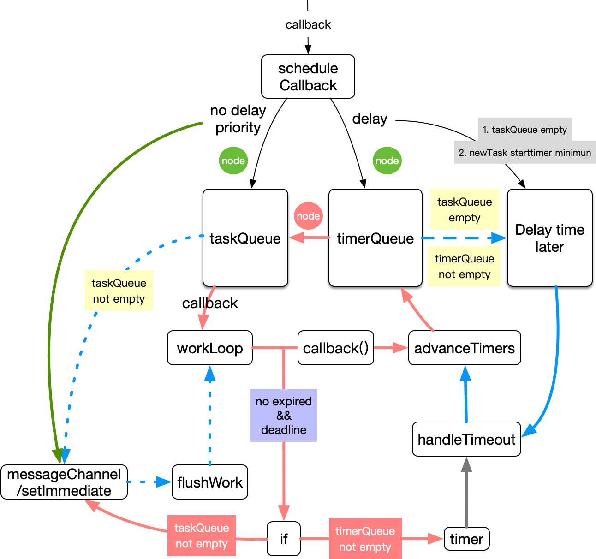

## 新版scheduler

上节说到了在`react16.8`版本的`scheduler`由`requestAnimation`以及`postmessage`实现，即对齐`frame`的方案。根据`react`官方相关[issue]([facebook/react#16271](https://github.com/facebook/react/pull/16271))的描述，`scheduler` 中 `requestAnimation` 构成的循环对`CPU`的利用率低于新版本`scheduler`中 `message` 构成的循环。此外通过一些[issue](https://github.com/facebook/react/pull/16271)也能看到`react`对代码质量的诸多考量。

​	现在开始新版scheduler的实现，大致画了一张运行流程图，有下面几点需要注意：

1. taskQueue与timerQueue是两个最小堆，后者的任务在一定时间(delay)之后被放到taskQueue中，taskQueue中的任务在到期之后才会执行。
2. timerQueue按照current+delay时间排序，taskQueue按照current+delay+priorityTime排序
3. 任务无法做到一定是在delay时间之后从timerQueue转移到taskQueue
4. `wookloop`每次批量执行任务的时间控制在`5m`s内，每次执行一个`task`之前会检查当前`wookloop`执行是否已经超过了`5ms`
5. `task`的到期时间相同的时候先加入的先执行



### 工具

#### 获取当前时间

> 代码质量体现在细节上：这里是直接替换掉getCurrentTime，而不是每次在函数中判断是否存在performance.now

```javascript
var hasNativePerformanceNow =
  typeof performance === 'object' && typeof performance.now === 'function';
var localDate = Date;
var getCurrentTime;
if (hasNativePerformanceNow) {
  var Performance = performance;
  getCurrentTime = function() {
    return Performance.now();
  };
} else {
  getCurrentTime = function() {
    return localDate.now();
  };
}
```

#### 定义优先级对应的时间

> 预期的用户交互的时间：USER_BLOCKING_PRIORITY_TIMEOUT

```javascript
const ImmediatePriority = 1;
const UserBlockingPriority = 2;
const NormalPriority = 3;
const LowPriority = 4;
const IdlePriority = 5;

const IMMEDIATE_PRIORITY_TIMEOUT = -1;
const USER_BLOCKING_PRIORITY_TIMEOUT = 250;
const NORMAL_PRIORITY_TIMEOUT = 5000;
const LOW_PRIORITY_TIMEOUT = 10000;
const IDLE_PRIORITY_TIMEOUT = 1073741823;

const priorityMap = {
  [ImmediatePriority]: IMMEDIATE_PRIORITY_TIMEOUT,
  [UserBlockingPriority]: USER_BLOCKING_PRIORITY_TIMEOUT,
  [NormalPriority]: NORMAL_PRIORITY_TIMEOUT,
  [LowPriority]: LOW_PRIORITY_TIMEOUT,
  [IdlePriority]: IDLE_PRIORITY_TIMEOUT
}
```

#### 一个简单的定时器

```
function requestHostTimeout(callback, ms) {
  taskTimeoutID = setTimeout(() => {
    callback(getCurrentTime());
  }, ms);
}
```

#### [最小堆](https://www.cxyxiaowu.com/1943.html)

> 最小堆必定是一个完全二叉树，而完全二叉树的父子节点之间的位置关系是确定的，因此可以通过数组来实现一个最小堆

代码稍微长，这里不做展示，因此列举下面要点：

1. 最小堆特点：在最小堆中节点的值是其子树的最小值。

2. 最小堆定理：数组中已知当前节点下标为`index`，那么左子节点为`2*index+1`，右子节点为`2*index+2`，父节点为`Math.floor((index - 1)/2)`

3. 最小堆插入元素：将新插入的元素`push`到数组，新插入的元素与其父节点比较，如果比父节点小，则交换父子节点位置。新插入的节点依次不断向上寻找，直到没有符合条件的节点为止。

4. 最小堆删除最小值元素：将最后一个节点替换到第一个节点的位置，然后将第一个节点下沉(满足节点是其子树的最小值即可)。

### 添加任务

伪代码如下，接收的参数描述如下

1. priorityLevel：优先级
2. delay：延迟调度的延时时间
3. callback：任务

```javascript
let taskIdCounter = 1;
function scheduleCallback(priorityLevel, callback, delay = 0) {        
				const currentTime = getCurrentTime();
        let startTime = currentTime + delay;
        let expirationTime = startTime + priorityMap[priorityLevel];
        const newTask = {
          id: taskIdCounter++,
          callback,
          priorityLevel,
          startTime,
          expirationTime,
          sortIndex: -1,
        };
        if (startTime > currentTime) {
          newTask.sortIndex = startTime;
          push(timerQueue, newTask);
          if (peek(taskQueue) === null && newTask === peek(timerQueue)) {
						// 在此之前还需取消掉之前的timeout，因此现在才是最小的定时器时间
            requestHostTimeout(handleTimeout, startTime - currentTime);
          }
        } else {
          newTask.sortIndex = expirationTime;
          push(taskQueue, newTask);
          if (!isHostCallbackScheduled && !isPerformingWork) {
            isHostCallbackScheduled = true; // 边界处理，确保一个事件循环里面只执行一个flushWork
            requestHostCallback(flushWork);
          }
        }     
        return newTask;
}
```

scheduleCallback首先会构建一个堆节点，其到期时间`expirationTime=currentTime+delay+priorityTime`。

> taskQueue根据currentTime+delay来进行排序，timerQueue根据currentTime+delay+priorityTime来进行排序

1. 当接收的参数`delay>0`的时候，会将新的堆节点添加到最小堆`timerQueue`中，并且如果`taskQueue`为空，并且新的堆节点是最小值，那么会在`delay`时间之后开始调度`timerQueue`与`taskQueue`中的各个任务。

2. 当接收到的参数`delay<=0`的时候，会将新的堆节点添加到最小堆`taskQueue`中，如果没有在调度的循环里，则开启调度。

这里可以看到在第一种情况`delay>0`的时候，在`taskQueue`中没有任务并且新节点到期时间不是`timerQueue`最小值的情况下，`scheduler`一直处于定时器的读秒阶段，一旦读秒结束，则继续开始刷新两个最小堆中的任务。注意新方案中并不会一直去轮询，与**对齐frame的方案**不同，不会每一帧都去判断是否有到期的任务需要执行。

> 注意：利用requestAnimation轮询对一般的应用来说，不会有太多的性能损耗，所以不必过多纠结这里的改进的价值在哪里，当你问到这个问题的时候，说明你的应用或许比较简单，根本用不着关心这一点。

可以看到这里添加一个新的任务不一定会开启新一轮的调度，因为有可能正在调度中，或者正在读秒，读秒之后就开始调度。为了确保调度机制的完整，需要在调度函数`workLoop`函数结束之前判断最小堆的状态来开启新一轮的调度。

#### delay时间之后再决定是否开启调度

`advanceTimers`用于将`timerQueue`中`timeout`的任务添加到`taskQueue`中，这里需要注意下面一点

> scheduler提供了一种能力，即使是后加入的任务，只要优先级足够高，那么就有可能在前面添加的任务之前执行

`handleTimeout`会调用`advanceTimers`来更新一下两个最小堆，然后根据下面的情况来来决定是读秒还是在下个事件循环中开始调度。

1. 如果`taskQueue`不为空，说明要尽快开始调度，则利用`requestHostCallback`在下个事件循环中开始调度
2. 如果`taskQueue`为空并且`timerQueue`不为空，则需要读秒，时间到了之后再调用`handleTimeout`来判断是读秒还是尽快调度。

```javascript
function advanceTimers(currentTime) {
  // Check for tasks that are no longer delayed and add them to the queue.
  let timer = peek(timerQueue);
  while (timer !== null) {
    if (timer.callback === null) {
      // Timer was cancelled.
      pop(timerQueue);
    } else if (timer.startTime <= currentTime) {
      // Timer fired. Transfer to the task queue.
      pop(timerQueue);
      timer.sortIndex = timer.expirationTime;
      push(taskQueue, timer);
    } else {
      // Remaining timers are pending.
      return;
    }
    timer = peek(timerQueue);
  }
}

function handleTimeout(currentTime) {
  isHostTimeoutScheduled = false;
  advanceTimers(currentTime);

  if (!isHostCallbackScheduled) {
    if (peek(taskQueue) !== null) {
      isHostCallbackScheduled = true;
      requestHostCallback(flushWork);
    } else {
      const firstTimer = peek(timerQueue);
      if (firstTimer !== null) {
        requestHostTimeout(handleTimeout, firstTimer.startTime - currentTime);
      }
    }
  }
}
```

#### 尽快开始调度

`scheduledHostCallback`是开始刷新任务的一个入口函数，这里先不予理会。这里介绍的是什么条件才会去执行这个入口函数？

首先我们需要知道什么是`MessageChannel`，如果搭建过websocket服务或者开过chrome插件的同学应该会很熟悉这个，这里提供一个相关的实践，[san-devtools](https://github.com/baidu/san-devtools)。简而言之就是一个通信管道。那么为什弃用`window.postmessage`而使用`MessageChannel`呢，我们在使用`window.postmessage`的时候会触发所有通过`addEventlistener`绑定的`message`事件处理函数，因此`react`为了减少串扰，用`MessageChannel`构建了一个专属管道，减少了外界的串扰（当外界通信频繁数据量过大，引起缓冲队列溢出而导致管道阻塞便会影响到`react`的调度性能）以及对外界的干扰。`window.postmessage`意味着是一个全局的管道，因此`MessageChannel`的缺点则是只能在一定的作用域下才生效。

其次`postmessage/setImmediate`触发的是一个宏任务，因此两个事件循环之间会有一段空闲时间处理页面的交互事件，`message`事件处理函数/定时器回调函数`performWorkUntilDeadline`中会调用`scheduledHostCallback`开始调度。并且在此之前设置了到期时间`deadline`，表示从当前时间开始，`scheduledHostCallback`只能够执行`yieldInterval=5ms`，在执行最小堆中的下一个任务之前如果发现超时了，那么会停止执行最小堆中的任务，并且如果有任务存留则在下一个事件循环中试图开启新的调度。停止执行最小堆中的任务也是为了响应用户的交互。不过如果这里用户的交互处理逻辑过长，会导致最小堆中的任务过多，因此交互处理逻辑耗时过多则表明应用开发者的代码低劣。

```javascript
let schedulePerformWorkUntilDeadline;
if (typeof setImmediate === "function") {
  schedulePerformWorkUntilDeadline = () => {
    setImmediate(performWorkUntilDeadline);
  };
} else {
  const channel = new MessageChannel();
  const port = channel.port2;
  channel.port1.onmessage = performWorkUntilDeadline;
  schedulePerformWorkUntilDeadline = () => {
    port.postMessage(null);
  };
}

function requestHostCallback(callback) {
  scheduledHostCallback = callback;
  if (!isMessageLoopRunning) {
    isMessageLoopRunning = true;
    schedulePerformWorkUntilDeadline();
  }
}

let yieldInterval = 5;
const performWorkUntilDeadline = () => {
  if (scheduledHostCallback !== null) {
    const currentTime = getCurrentTime();
    deadline = currentTime + yieldInterval;
    const hasTimeRemaining = true;
    let hasMoreWork = true;
    try {
      hasMoreWork = scheduledHostCallback(hasTimeRemaining, currentTime);
    } finally {
      if (hasMoreWork) {
        schedulePerformWorkUntilDeadline();
      } else {
        isMessageLoopRunning = false;
        scheduledHostCallback = null;
      }
    }
  } else {
    isMessageLoopRunning = false;
  }
};
```

### 调度

在`flushWork`中需要确保一段时间只有一个`flushWork`，因此需要取消`requestHostCallback`读秒，以及利用`isPerformingWork`加锁。

```javascript
function flushWork(hasTimeRemaining, initialTime) {
  isHostCallbackScheduled = false;
  if (isHostTimeoutScheduled) {
    isHostTimeoutScheduled = false;
    cancelHostTimeout();
  }
  isPerformingWork = true;
  try {
    return workLoop(hasTimeRemaining, initialTime);
  } finally {
    isPerformingWork = false;
  }
}
```

正式调度在`workLoop`中，代码太长可以结合文章开头的图来理解。

1. 每次开始执行`task`之前，先把`timerQueue`中超时的任务压入`taskQueue`，然后判断当前整个调度是否超时了(`5ms`)，没有超时那么刷新`taskQueue`中到期的任务。在此过程中，如果任务返回了一个函数，那么这个函数会继承这个任务的到期时间，也就是相当于模拟了一个微任务队列，用户可以在添加的函数中返回一个函数，这个函数会立即执行（也就在当前事件循环中，并且比当前事件循环中其他的微任务更早执行）。
2. 当调度超时或者没有过期的任务的时候，停止对`taskQueue`中的任务进行扫描（执行），然后如果`taskQueue`不为空，那么返回`true`，那么在下一个事件循环中会继续调度(`flushWork`)。如果`taskQueue`为空，`timerQueue`不为空，则开始以最小堆的最小值读秒，读秒完成之后再通过`handleTimeout`判断是否继续读秒还是尽快开启新的调度。

```javascript
function workLoop(hasTimeRemaining, initialTime) {
  let currentTime = initialTime;
  advanceTimers(currentTime);
  currentTask = peek(taskQueue);
  while (currentTask !== null) {
    if (
      currentTask.expirationTime > currentTime &&
      (!hasTimeRemaining || shouldYieldToHost())
    ) {
      break;
    }
    const callback = currentTask.callback;
    if (typeof callback === "function") {
      currentTask.callback = null;
      currentPriorityLevel = currentTask.priorityLevel;
      const didUserCallbackTimeout = currentTask.expirationTime <= currentTime;
      const continuationCallback = callback(didUserCallbackTimeout);
      currentTime = getCurrentTime();
      if (typeof continuationCallback === "function") {
        currentTask.callback = continuationCallback;
      } else {
        if (currentTask === peek(taskQueue)) {
          pop(taskQueue);
        }
      }
      advanceTimers(currentTime);
    } else {
      pop(taskQueue);
    }
    currentTask = peek(taskQueue);
  }
  // Return whether there's additional work
  if (currentTask !== null) {
    return true;
  } else {
    const firstTimer = peek(timerQueue);
    if (firstTimer !== null) {
      requestHostTimeout(handleTimeout, firstTimer.startTime - currentTime);
    }
    return false;
  }
}
```

## 总结

​	这一小节，介绍了新版`scheduler`的实现原理，相对于老版而言，在有足够任务的时候，新版将时间切得更细，`5ms`一片，这样有更多的时间来响应用户的操作。当没有任务的时候，不会因为外部`postmessage`执行`react`中的`message`事件处理函数，运行时代码更加干净。下一节会介绍`帧对齐方案`中的启发式算法的原理，以及游戏中的`vsync`概念。

​	有任何不正确的地方请直接评论或者联系我。


